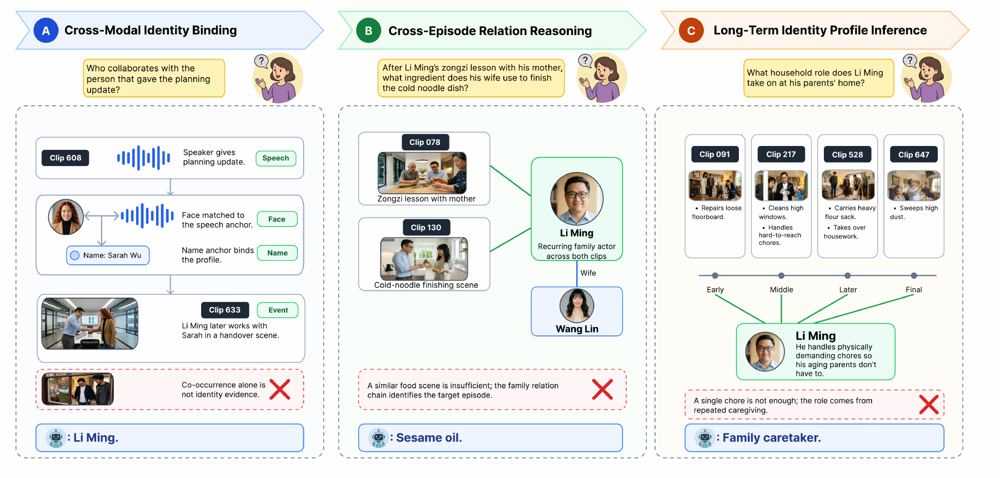

# ICM-Bench: Person-Level Identity Reasoning in Multimodal Agents with Long-Term Memory

[](https://arxiv.org/abs/2609.04438)
[](https://huggingface.co/datasets/ryanren0330/ICM-Bench)
[](LICENSE)
[](LICENSE-DATASET)

This is the official repository for [ICM-Bench](https://arxiv.org/abs/2609.04438), including the video generation pipeline, M3-Agent, Vgent, and HippoRAG2 evaluation integrations, and open-ended answer judging.

**Shidu Ren, Yunze Liu, Xing Liu, Chi-Hao Wu, Enmin Zhou, Junxiao Shen**

## Updates

- **September 2026:** The [paper](https://arxiv.org/abs/2609.04438), [benchmark](https://huggingface.co/datasets/ryanren0330/ICM-Bench), and evaluation code are available.

## Overview

ICM-Bench evaluates whether multimodal agents can remember recurring people and reason about their relationships over time. It contains **839 synthetic clips spanning 141 minutes** and **1,217 open-ended questions** about six recurring adults in a one-year life album.

<p align="center">
  
</p>

*Three memory challenges: linking faces, voices, and names; reasoning across episodes; and inferring a person's recurring roles, habits, and relationships. The panels illustrate the tasks rather than reproduce released questions.*

| Question family | Questions | Evaluation focus |
|---|---:|---|
| Identity Recall | 400 | Recover an event associated with a person |
| Cross-Episode Identity Retrieval | 500 | Connect person-linked evidence across episodes |
| Long-Term Identity Profile Inference | 317 | Infer recurring behavior and relationships over the timeline |

## Installation

Clone the repository with its Vgent dependency:

```bash
git clone --recurse-submodules https://github.com/Shidu-Ren/ICM-Bench.git
cd ICM-Bench
cp .env.example .env
```

Set your local data, output, and model directories in `.env`, together with the API keys needed for your chosen component. Load these settings in each shell:

```bash
set -a
source .env
set +a
```

Generation and the evaluated frameworks use different dependencies. Create a separate environment for each component and follow its setup instructions:

| Component | Setup and usage |
|---|---|
| Video generation | [generation/README.md](generation/README.md) |
| M3-Agent | [evaluation/m3_agent/README.md](evaluation/m3_agent/README.md) |
| Vgent | [evaluation/vgent/README.md](evaluation/vgent/README.md) |
| HippoRAG2 | [evaluation/hipporag2/README.md](evaluation/hipporag2/README.md) |
| Answer judging | [evaluation/judging/README.md](evaluation/judging/README.md) |

The API settings use `GOOGLE_API_KEY`, `OPENAI_API_KEY`, and, for compatible endpoints, `OPENAI_BASE_URL`. The direct caption-memory baseline implementation is not included in this release.

## Benchmark Data

Download the benchmark from [Hugging Face](https://huggingface.co/datasets/ryanren0330/ICM-Bench):

```bash
python -m pip install huggingface_hub
hf download ryanren0330/ICM-Bench \
  --repo-type dataset \
  --local-dir "$ICM_BENCH_DATA_ROOT"

tar -xf "$ICM_BENCH_DATA_ROOT/videos.tar" -C "$ICM_BENCH_DATA_ROOT"
```

The extracted dataset has the following layout:

```text
ICM-Bench/
├── videos/                         # clip_000.mp4 ... clip_838.mp4
│   └── metadata.jsonl
├── annotations/
│   ├── qa_test.jsonl               # recommended QA file
│   ├── qa_test.json                # the same questions as a JSON array
│   ├── characters.json
│   ├── dataset_statistics.json
│   └── schema.json
└── resources/
    ├── asr_transcripts/            # 829 speakerless transcripts
    └── transcripts_with_speakers/ # 829 reference transcripts
```

Read the questions with:

```python
import json
import os
from pathlib import Path

root = Path(os.environ["ICM_BENCH_DATA_ROOT"])
with (root / "annotations" / "qa_test.jsonl").open() as f:
    questions = [json.loads(line) for line in f if line.strip()]

print(len(questions))  # 1217
print(questions[0]["question"])
```

## Evaluation

Recall and Retrieval questions use memory clips up to and including each item's `before_clip`; Profile questions use the full timeline. Video-based settings also receive `clip_000`, a calibration clip supplying a common face–voice reference.

Use `resources/asr_transcripts/` for speakerless transcript inputs. Reference answers, target character IDs, evidence annotations, `characters.json`, and speaker-labeled transcripts are evaluator-side resources and should not be included in an answerer's input.

Each method directory contains its adapters and upstream implementation or dependency. Follow the [evaluation guide](evaluation/README.md) for the command sequence from downloaded data to system answers. The shared judge accepts JSONL records containing `id`, `question`, `answer` (the reference), and `response`:

```bash
python -m pip install -r evaluation/judging/requirements.txt
python evaluation/judging/scripts/rejudge_openqa_m3agent_style.py \
  --input "$ICM_BENCH_OUTPUT_ROOT/SYSTEM/answers.jsonl" \
  --output "$ICM_BENCH_OUTPUT_ROOT/SYSTEM/answers.judged.jsonl" \
  --summary "$ICM_BENCH_OUTPUT_ROOT/SYSTEM/answers.judged.summary.json"
```

The judge compares semantic content rather than exact wording. See [answer judging](evaluation/judging/README.md) for the Gemini evaluator and the independent OpenAI-compatible judge.

## Video Generation

The generation pipeline plans a theme, timeline, cast, and shots; creates character and scene references; renders videos; and produces recurring-character speech and subtitles. Presets are provided in [generation/configs/video_series_presets/](generation/configs/video_series_presets/).

In a dedicated environment, inspect the pilot configuration locally:

```bash
cd generation
python -m pip install -r requirements.txt
python -m video_generator.pipeline \
  --config configs/video_config_pilot.yaml \
  --preflight-only
```

To generate the pilot, remove `--preflight-only` after configuring your Google API key. FFmpeg is required for video processing. The [generation guide](generation/README.md) covers planning, rendering, voice processing, shot review, and export.

## Code Organization

```text
ICM-Bench/
├── assets/             # paper illustration for this README
├── configs/            # example local path configuration
├── generation/         # video pipeline, presets, and rendering utilities
└── evaluation/
    ├── m3_agent/       # M3-Agent implementation and ICM-Bench adapters
    ├── vgent/          # adapters and pinned upstream submodule
    ├── hipporag2/      # HippoRAG2 implementation and corpus/QA adapters
    └── judging/        # semantic-equivalence prompts and evaluators
```

## License

ICM-Bench code is released under the [MIT License](LICENSE), and the dataset under [CC BY-NC-SA 4.0](LICENSE-DATASET). Bundled research code retains its upstream licenses; see [NOTICE](NOTICE) and [upstream sources](evaluation/UPSTREAMS.md).

## Citation

If you use ICM-Bench in your research, please cite:

```bibtex
@article{ren2026icmbench,
  title={ICM-Bench: Person-Level Identity Reasoning in Multimodal Agents with Long-Term Memory},
  author={Ren, Shidu and Liu, Yunze and Liu, Xing and Wu, Chi-Hao and Zhou, Enmin and Shen, Junxiao},
  journal={arXiv preprint arXiv:2609.04438},
  year={2026},
  url={https://arxiv.org/abs/2609.04438}
}
```

## Acknowledgments

Our evaluation integrations build on [M3-Agent](https://github.com/ByteDance-Seed/m3-agent), [Vgent](https://github.com/xiaoqian-shen/Vgent), and [HippoRAG2](https://github.com/OSU-NLP-Group/HippoRAG). We thank their authors for making these frameworks available.
